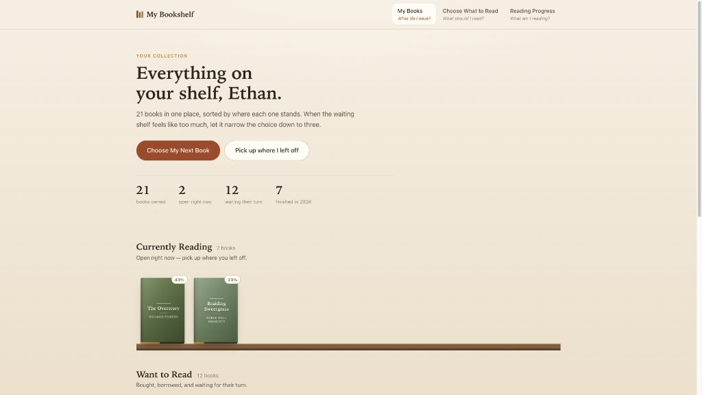
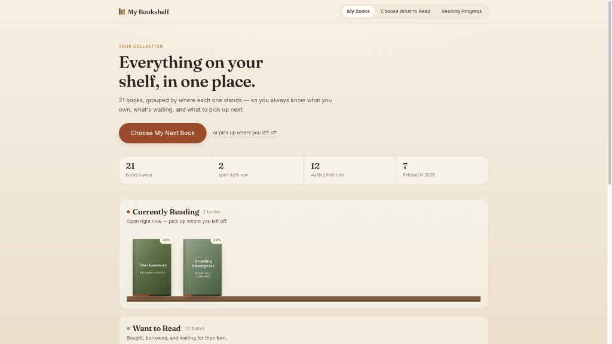

# My Bookshelf

A digital bookshelf for people who buy books faster than they read them.
Three screens tell one story: **What do I have? → What should I read? → What am I reading?**

Live: https://my-bookshelf-project-m9mec6xzk-ethan-wood-is.vercel.app

---

## 1. Need, persona, capability, value

These four are easy to collapse into each other, so they are stated separately on purpose.

| | |
| --- | --- |
| **Need** | Readers accumulate books faster than they can remember or organize them, so they lose track of what they own and stall on what to read next. |
| **Persona** | Avid readers who buy regularly, keep a growing physical collection, and repeatedly get stuck choosing their next book. |
| **Primary capability** | Browse the collection and choose what to read next. |
| **Fundamental value** | **Clarity.** The reader always knows what they have, what is waiting, and what to pick up next. |

The distinction that mattered while building: the *need* is disorganization, the *capability* is
browsing and choosing, and the *value* is clarity. Clarity is not a feature — it is the result the
features have to produce. That is why the landing screen spends its space on grouping and counts
rather than on tools.

## 2. The three screens

| Screen | Its single job | Why it earned a slot | Design question it examines |
| --- | --- | --- | --- |
| **My Books** (`/`) | Show the whole collection as a visual shelf, grouped by reading status | This is the need made visible. Without it the reader still cannot see what they own | Can a reader immediately understand what this app does and see the value of an organized collection? |
| **Choose What to Read** (`/choose`) | Cut the Want to Read shelf down to three books and say *why* each suits today | A shelf can only show what you own. This screen is the capability — it makes the decision, not just the display | Does this actually make choosing easier than looking at my shelf? |
| **Reading Progress** (`/reading`) | Keep progress and status current after a book is chosen, against a yearly goal | Without it the first screen goes stale and the grouping stops being true | Does tracking my reading keep an organized sense of what I've read and what's next? |

## 3. Design question plan

| # | Question | Prediction | Rests on |
| --- | --- | --- | --- |
| 1 | *Last time you had a pile of books and weren't sure what to read, what did you do?* | Browsed the shelf, scrolled a list, asked someone, or picked at random | My Books, Choose What to Read |
| 2 | *What do you use to track books you own or want to read, and what's annoying about it?* | Goodreads, StoryGraph, notes, a spreadsheet, or nothing; it won't clearly show what they own or what's next | My Books |
| 3 | *What would have to be true for you to switch from what you do now?* | Easy to use, clearly shows what they own, and beats their current way of choosing | My Books, Choose What to Read |
| 4 | *How often do you look through your books trying to decide, and when?* | Regularly — after finishing a book, after buying, or when free time appears | My Books, Choose What to Read |
| 5 | *What have you already tried for tracking your reading?* | Goodreads, spreadsheets, notes, physical lists, or memory | All three screens |
| 6 | *Five-second look, then hidden: what is this app for?* | "Organizes my books and helps me pick what's next" | My Books landing, especially the shelf and **Choose My Next Book** |

Questions 1–2 test the **need**, 3 tests the **value**, 4–5 test the **persona**, and 6 tests whether
the **capability** actually reads at a glance.

## 4. Design justification and first read

**Does the landing screen signal the capability and value before reading?**
Mostly. Ignoring the words, you see rows of book spines resting on wooden planks — the page
reads as a bookshelf before any text is processed. One dark russet button is the only saturated
element on a warm, muted page, so the eye lands on the single primary action. What does *not*
survive the squint test is which action that button performs; the reader gets "there is one main
thing to do here," and has to read one short phrase to learn it is choosing a book.

**Does everything earn its place?**
Above the fold there are only six things: the title, the primary button, one quiet aside link,
four counts, and the first two shelves. "Pick up where you left off" is deliberately a small
underlined link rather than a second button, so two calls to action never compete. The counts sit
in a flat bordered strip with no shadow, so they read as a summary rather than a card competing
with the shelves. The honest tension is that the covers are the most visually prominent thing on
the page and do pull attention from the button — accepted, because the brief makes covers the
primary visual element and they are what communicates "your collection" pre-reading.

**What belongs together, and which Gestalt principle says so?**

| Grouping | Principle | How it is expressed |
| --- | --- | --- |
| A shelf heading, its caption, and its books | Common region | Each shelf sits in one bordered, opaque panel |
| The three shelves as one collection | Proximity | Shelves sit `1.5rem` apart but `3rem` below the summary strip |
| Reading status across all three screens | Similarity | One colour means one status everywhere: waiting, reading, finished |
| Books standing on a single shelf | Uniform connectedness | A wooden plank runs under each row of covers |
| Mood filter as one control | Common region | The four mood chips share a single bordered panel |

**Do screens 2 and 3 stay on mission, and can you get home from everywhere?**
Yes. Choose What to Read shows three books, one reason each, a mood filter, and two actions per
card — no search, no browsing, nothing that turns it back into a shelf. Reading Progress shows
only open books, their controls, the goal, and recently finished. Every screen carries the
persistent header plus an explicit **← Back to My Books** link above the title, so the landing
screen is one click away from anywhere.

**What the AI got wrong, and what changed**

| What the first output did | Why it was a problem | The change |
| --- | --- | --- |
| Greeted the reader by name in the headline | Greeting is not value; it competed with the one thing the screen must say | Headline states the value: "Everything on your shelf, in one place." |
| Nav items carried a second line ("What do I have?") | Made the nav read as three stacked blocks instead of one control | Single-line labels in one segmented track |
| Shelf panels were drawn at ~1.05:1 contrast | Common region only groups if the region is visible — it effectively wasn't | Opaque fill, stronger border and a soft shadow, defined once as shared tokens |
| Gold meant "finished" in badges but also filled in-progress bars | Same colour meaning two things breaks similarity across screens | Three status tokens applied everywhere a status appears |
| A "Want to Read" pill repeated on all three pick cards | Three identical labels say less than one label over the group | One group label on the row above the cards |
| Recommendations could return three cards with the same reason | A shortlist is only better than a shelf if the reasons differ | Each reason is used at most once per set |
| The page slider looked like the progress bar | An interactive control must not look like a readout | Slider restyled with a distinct track and thumb |
| The save button stayed "primary" with nothing to save | A primary button should signal an available action | Drops to secondary once progress is saved |

**What motivated each change**
The headline and nav changes came from question 6 — anything competing in the first five seconds
had to go. The panel contrast and the grouped "Want to Read" label came from common region and
proximity: grouping that cannot be seen is not grouping. The colour unification came from
similarity, so the three screens read as one product. The reason de-duplication came from
questions 1 and 3, since the app only beats a physical shelf if its explanations are distinct.
The slider and button changes were signaling fixes: controls should look like controls, and
emphasis should track availability.

### The landing screen, before and after

Using the Gestalt grouping principle of common region, the user understands which books fall in
to the categories of currently reading, want to read, and finished, on the landing page.

**First version**



**Revised version**



---

## Technical appendix

**Stack.** React 19 + TypeScript (Vite) in `client/`. The backend exists twice: the original
ASP.NET Core MVC app in `server/` (controllers, services, JSON-file repository), and a port of the
same domain to TypeScript serverless functions in `api/` so the project can deploy to Vercel. Both
serve an identical API, verified by diffing their responses endpoint by endpoint. Book covers are
drawn in CSS from each book's palette, so nothing depends on external image hosting.

**Run the .NET version** (two terminals):

```bash
cd server && dotnet run      # API on http://localhost:5229
cd client && npm install && npm run dev   # UI on http://localhost:5173
```

**Run the Vercel version:** `npm install && npx vercel dev`.
Storage uses Upstash Redis via `KV_REST_API_URL` / `KV_REST_API_TOKEN`; without them the app falls
back to in-memory data and says so in the logs. `GET /api/health` reports storage state.

**Main endpoints**

| Method | Route | Purpose |
| --- | --- | --- |
| `GET` | `/api/shelf` | Shelves, counts and goal — everything My Books needs |
| `GET` | `/api/recommendations?mood=&count=` | A shortlist with a reason per pick (`AnyMood`, `ShortRead`, `Familiar`, `Surprise`) |
| `PUT` | `/api/books/{id}/progress` | Record a page; the book changes shelf automatically at 0 or the last page |
| `PUT` | `/api/books/{id}/status` | Move between shelves, optionally with a 1–5 rating |
| `POST` | `/api/books/{id}/skip` | "Save for later" — stops suggesting it for 12 hours |
| `PUT` | `/api/shelf/goal` | Change the yearly goal |
| `POST` | `/api/shelf/reset` | Restore the starting collection |

**Layout**

```
client/src/   pages/ (one per screen), components/, state/, api/, lib/
server/       Controllers/, Models/, Services/, Data/SeedData.cs   (.NET MVC)
api/          Vercel serverless functions + _lib/ (ported domain)
```
